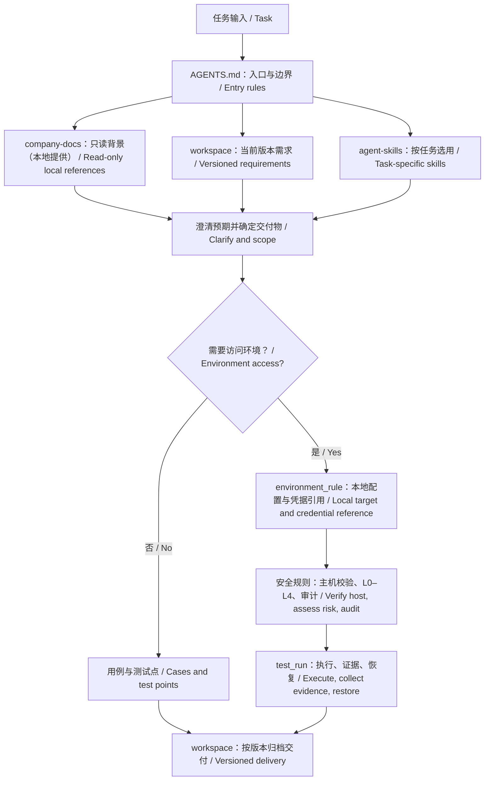

# Team AI Framework

团队 AI 协作框架：统一管理 Agent 入口规则、技能、Hermes 部署定义、标准测试工作区和安全的本地环境模板。运行数据与真实密钥始终不进入 Git。

Reusable framework for operating an AI-enabled delivery team. It versions agent
entry rules, skills, Hermes deployment definitions, standard test workspaces,
and safe local-environment templates together. Runtime data and real secrets
are always kept outside Git.

## Layout

目录说明：

- `deployment/hermes/`：Hermes 容器、配置与治理文件。
- `environment_rule/`：环境接入规则、安全控制及不含密钥的模板。
- `agent-skills/`：供 Agent 复用的工作流程和输出模板。
- `company-docs/`：本地只读产品及接口资料；公开仓库不提供企业内部文档。
- `workspace/`：需求、测试用例与报告的项目工作区。
- `test_run/`：标准测试工作区及任务脚本生命周期目录。

- `deployment/hermes/` — Hermes container, configuration, and governance assets.
- `environment_rule/` — environment onboarding rules, safety controls, and
  secret-free templates.
- `agent-skills/` — reusable workflows and output templates for agents.
- `company-docs/` — local, read-only product/API documents; proprietary sources
  are intentionally not distributed in this public repository.
- `workspace/` — project workspace structure for requirements, test cases, and reports.
- `test_run/` — standard test workspace and task-operation script lifecycle.

## Before use

使用前：从部署模板建立本地运行配置；通过获批的本地密钥存储或部署系统填写 `environment_rule/credentials.env`，绝不提交真实值；在本地创建自己的环境清单、服务定义、SSH 配置及主机指纹；将获批的 SSH 私钥放入已忽略的 `environment_rule/ssh/`；远程执行前阅读 `environment_rule/docs/UNATTENDED-SAFETY.md`；从 `deployment/hermes/container/docker-compose.yml` 启动 Hermes，修改挂载或权限前阅读相邻的中文规则。

1. Create local runtime configuration from the templates under deployment.
2. Fill `environment_rule/credentials.env` through an approved local secret
   store or deployment system; never commit real values.
3. Create your own environment inventory, service definitions, SSH configuration,
   and host fingerprints locally.
4. Place approved SSH private keys in the ignored `environment_rule/ssh/` folder.
5. Review `environment_rule/docs/UNATTENDED-SAFETY.md` before remote execution.
6. Run Hermes from `deployment/hermes/container/docker-compose.yml`; consult the
   adjacent Chinese mount-rule document before changing volumes or permissions.

## 最佳实践流程 / Best-practice workflow

先按 `AGENTS.md` 定位任务，再只读取相关背景、版本资料与技能。公开版不包含企业资料和具体环境配置，须由使用者在本地提供；缺失时不得猜测。需要环境操作时，从 `environment_rule/` 解析目标与凭据引用并遵守安全边界；执行脚本和证据放在 `test_run/`，最终交付回到对应版本的 `workspace/`。

Start with `AGENTS.md`, then load only relevant references, versioned materials, and skills. The public edition requires locally supplied product documents and environment definitions; never guess missing facts. Resolve environment targets from `environment_rule/`, keep execution artifacts in `test_run/`, and deliver results to the matching version in `workspace/`.
